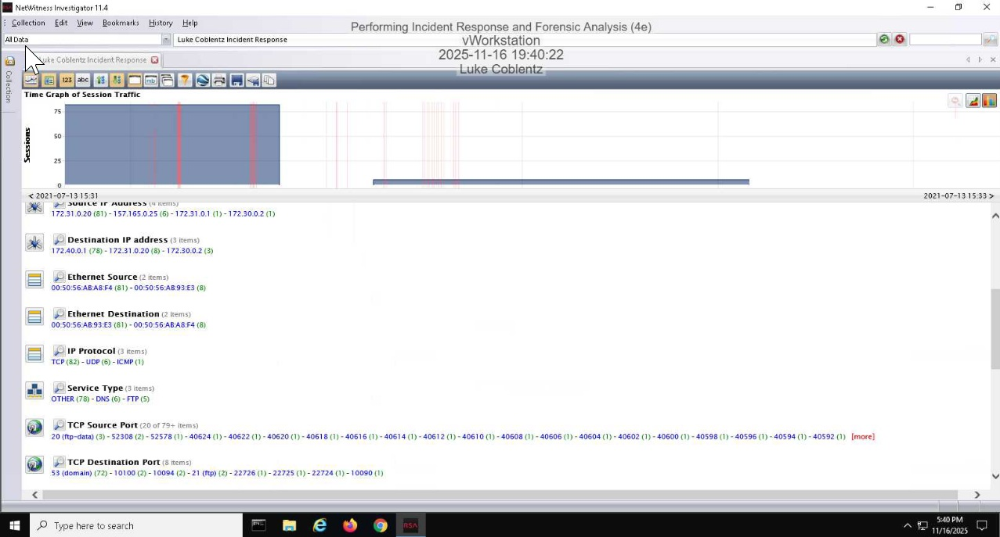
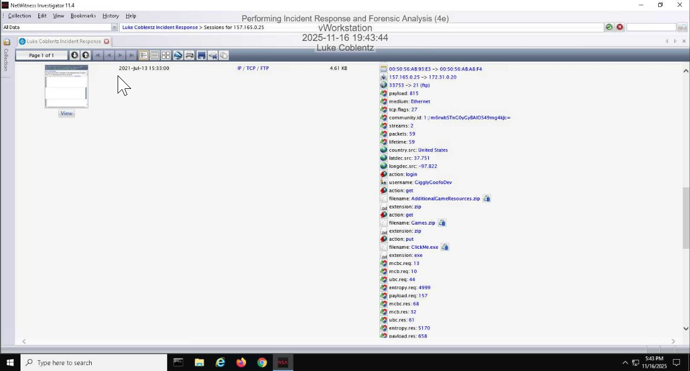
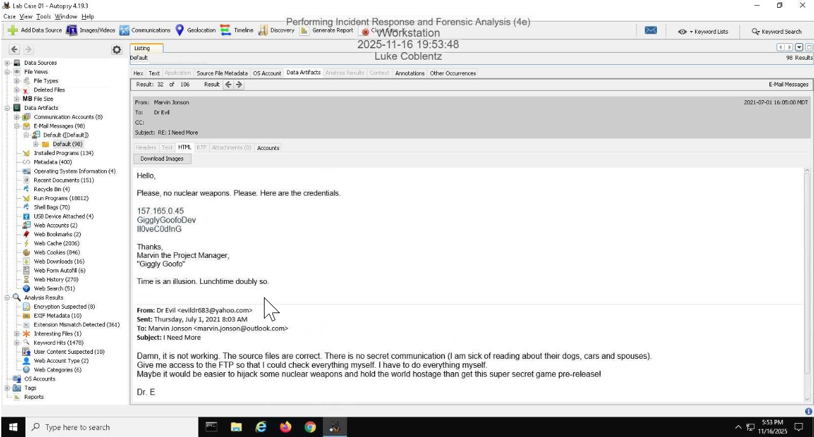
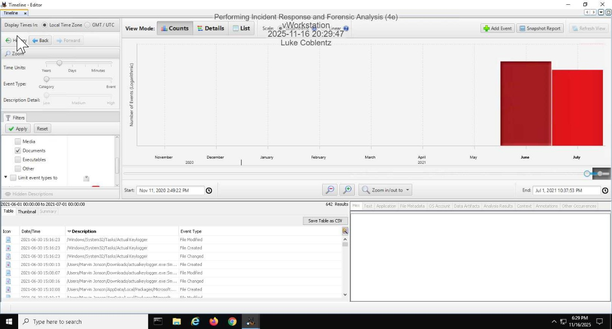
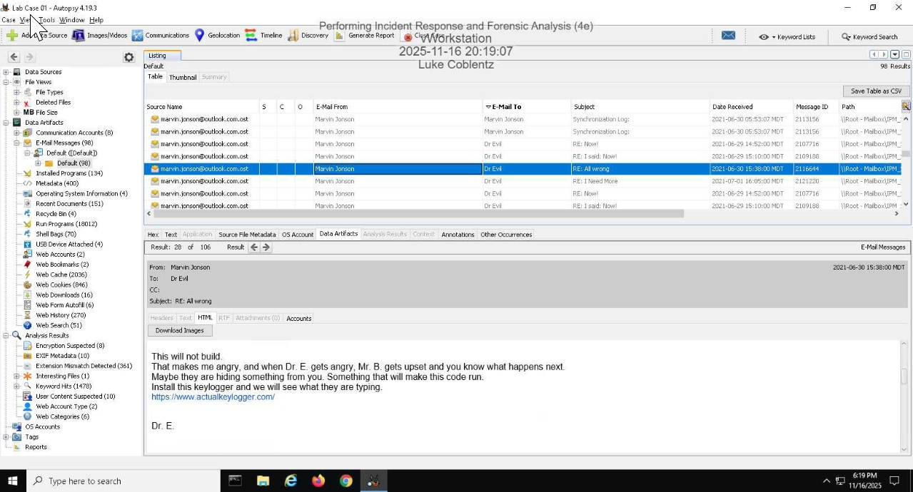

# Incident Response & Forensic Analysis

## Overview
In this lab, I performed a full incident response investigation by analyzing network traffic and disk artifacts to identify a potential security breach involving unauthorized data exfiltration.

## Objective
- Analyze a PCAP file for forensic evidence  
- Investigate compromised credentials  
- Identify the scope and impact of the incident  
- Build an incident response report  

---

## Tools Used
- Wireshark  
- Disk analysis tools  
- Log analysis techniques  

---

## Investigation Summary

### 1. Network Traffic Analysis
- Reviewed PCAP data using Wireshark
- Identified suspicious traffic involving large file transfers
- Observed communication between internal systems and an external IP

### 2. Indicators of Compromise (IOCs)
- External IP: `157.165.0.25`
- Internal server: `172.31.0.20`
- Multiple `.zip` file transfers detected
- Use of compromised FTP credentials

### 3. Timeline of Events
- Incident Occurred: July 13, 2021 (15:31–15:33)
- Incident Discovered: July 31, 2021
- Incident Reported: July 31, 2021

### 4. Root Cause
- Credentials were exposed through an email containing FTP login information
- Unauthorized access allowed external attacker to exfiltrate sensitive data

---

## Impact Assessment
- Systems affected:
  - Employee workstation
  - Internal FTP server  
- Data at risk:
  - Confidential company files  
  - Potential intellectual property  
- Threat type:
  - Data exfiltration  
  - Credential compromise  

---

## Actions Taken
- Identified compromised systems and accounts  
- Traced unauthorized file transfers  
- Documented attack timeline and scope  
- Classified incident severity as **HIGH**

---

## Lessons Learned
- Importance of securing credentials and avoiding plaintext exposure  
- Monitoring network traffic is critical for detecting abnormal behavior  
- Early detection can significantly reduce damage  
- Incident response requires both network and host-level analysis  

---

## Skills Demonstrated
- Incident response workflow  
- Network traffic analysis  
- Forensic investigation  
- Log and evidence analysis  
- Security reporting  

---

## Screenshots
## Screenshots

### Network Activity Timeline

This time graph shows spikes in network activity during the incident window, indicating abnormal behavior and potential data exfiltration.

---

### Suspicious Session Analysis

Detailed session analysis revealed FTP activity involving file transfers (.zip and .exe), suggesting unauthorized data movement and possible malware transfer.

---

### Compromised Credentials Evidence

An email containing FTP credentials was identified, confirming that sensitive login information was exposed and used by the attacker.

---

### Malware Activity Timeline

System timeline analysis revealed events associated with a keylogger, confirming malware installation and persistence on the compromised system.

---

### Phishing / Social Engineering Evidence

Email communications demonstrate social engineering tactics used to manipulate the user into installing malicious software, leading to system compromise.
---

## Conclusion
This lab simulated a real-world cybersecurity incident involving credential compromise and data exfiltration. Through forensic analysis and structured investigation, I was able to identify the attack vector, assess the impact, and document the incident response process.
