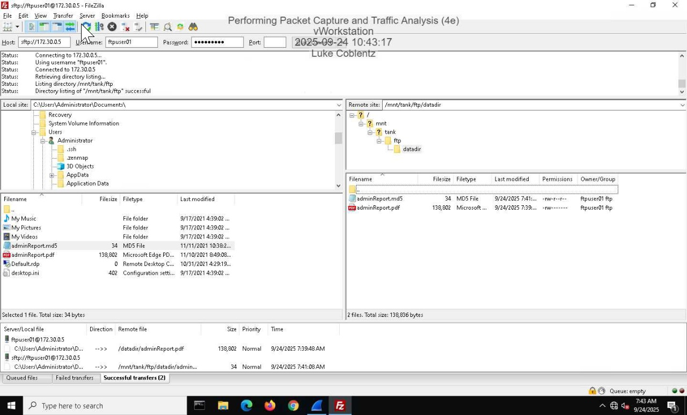
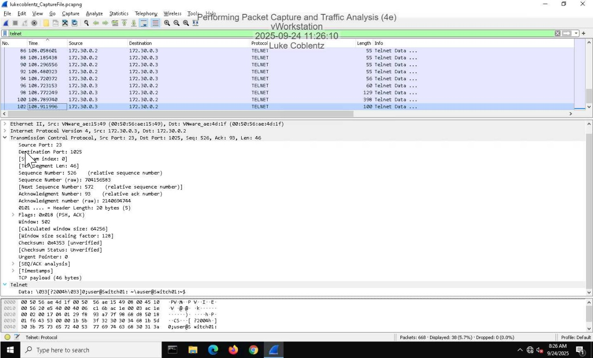
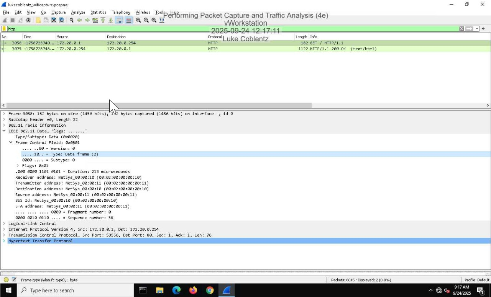
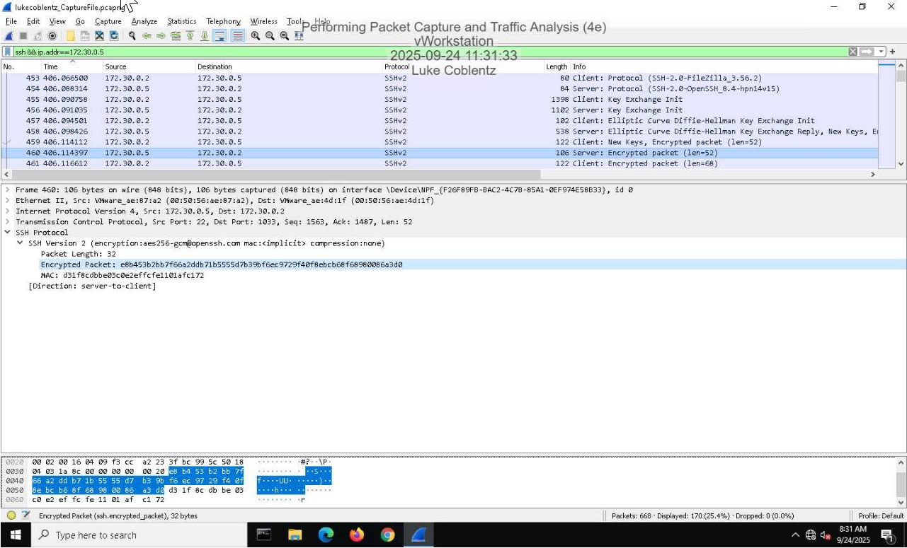
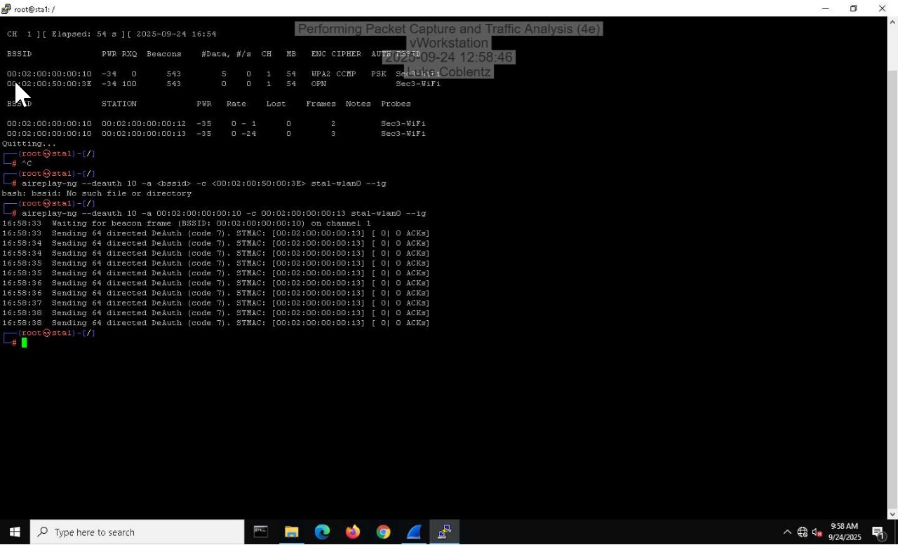

# Network Traffic Analysis with Wireshark

## Overview
This project demonstrates network traffic analysis using Wireshark to inspect and interpret various protocols, including FTP, HTTP, ICMP, and SSH. The goal was to understand how data is transmitted across networks, identify differences between encrypted and unencrypted traffic, and analyze both normal and malicious activity.

## Objective
- Capture and analyze network traffic using Wireshark  
- Identify and interpret different network protocols  
- Compare encrypted vs unencrypted traffic  
- Detect suspicious or malicious activity in packet captures  

---

## Tools Used
- Wireshark  
- Kali Linux  
- Network simulation environment  

---

## Analysis Summary

### 1. File Transfer Traffic (FTP vs SFTP)
- Observed FTP traffic transmitting data in plaintext  
- Identified file transfers including credentials and filenames  
- Compared with SFTP traffic, which encrypts all communication  

### 2. ICMP Packet Analysis
- Analyzed ICMP packets (ping requests and replies)  
- Examined packet structure, including headers and payload data  
- Identified how ICMP is used for network diagnostics  

### 3. HTTP Traffic Inspection
- Inspected HTTP packets and extracted readable data  
- Observed how unencrypted web traffic exposes request and response information  
- Identified potential risks of transmitting sensitive data over HTTP  

### 4. SSH Encrypted Traffic
- Analyzed SSHv2 packets and encryption negotiation  
- Observed encrypted payload data in packet bytes  
- Compared encrypted SSH traffic to plaintext protocols like FTP  

### 5. Wireless Network Traffic & Security
- Analyzed Wi-Fi traffic including SSID and channel information  
- Observed secure vs unsecured wireless communication  
- Examined elements of the WPA2 four-way handshake  

### 6. Malicious Traffic (Deauthentication Attack)
- Generated and analyzed deauthentication packets  
- Observed how attackers can disconnect devices from a network  
- Identified abnormal packet behavior associated with wireless attacks  

---

## Key Findings
- Unencrypted protocols (FTP, HTTP) expose sensitive data  
- Encrypted protocols (SSH, SFTP) protect confidentiality  
- Packet-level analysis reveals detailed communication patterns  
- Wireless networks are vulnerable to deauthentication attacks  
- Understanding protocol behavior is essential for detecting threats  

---

## Lessons Learned
- Importance of encryption in securing network communications  
- Ability to differentiate normal vs suspicious traffic  
- Value of packet-level visibility in cybersecurity investigations  
- Understanding protocols is critical for both attack and defense  

---

## Skills Demonstrated
- Network traffic analysis  
- Protocol analysis (FTP, HTTP, ICMP, SSH)  
- Packet inspection using Wireshark  
- Identifying security risks in network communication  
- Understanding encrypted vs unencrypted traffic  

---

## Screenshots

### FTP File Transfer (Unencrypted Traffic)

This screenshot shows FTP traffic where file transfers occur in plaintext, exposing sensitive information such as filenames and credentials.

---

### ICMP Packet Analysis

This image displays ICMP packet details, including headers and payload data, demonstrating how ping requests and responses function.

---

### HTTP Traffic Inspection

HTTP packet analysis reveals readable request and response data, highlighting the risks of unencrypted web traffic.

---

### SSH Encrypted Traffic

This screenshot shows encrypted SSH traffic, where payload data is not readable, demonstrating the effectiveness of encryption.

---

### Deauthentication Attack (Malicious Traffic)

This image shows deauthentication packets used to disconnect devices from a wireless network, illustrating a common wireless attack technique.

---

## Conclusion
This project demonstrates how network traffic analysis can be used to understand communication patterns, identify vulnerabilities, and detect malicious activity. By comparing encrypted and unencrypted protocols and analyzing both normal and attack traffic, this lab highlights the critical role of packet analysis in cybersecurity.
