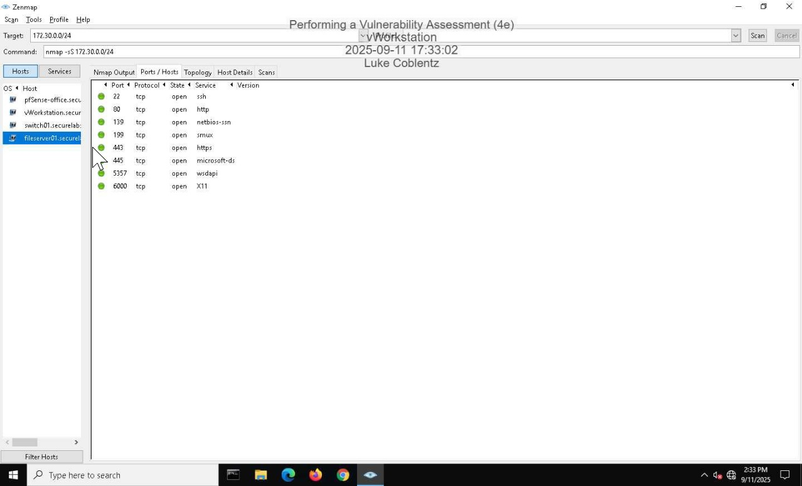
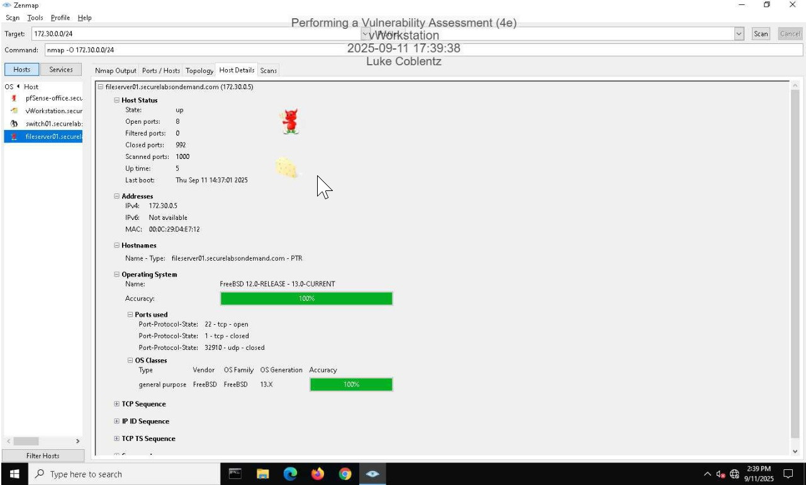
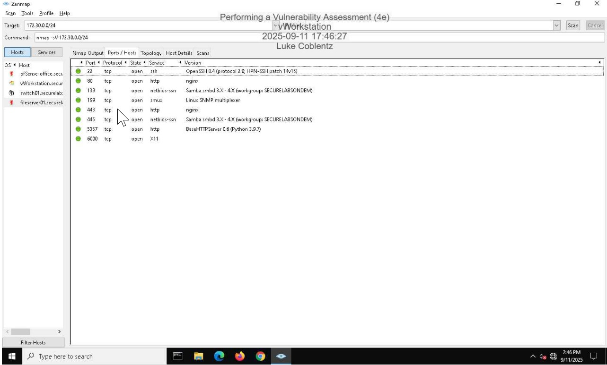
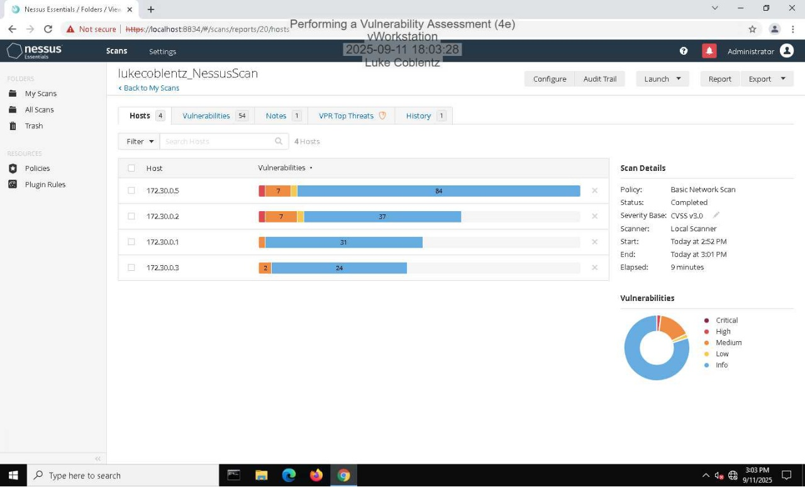
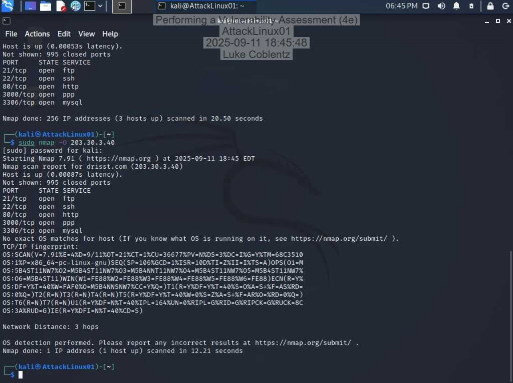
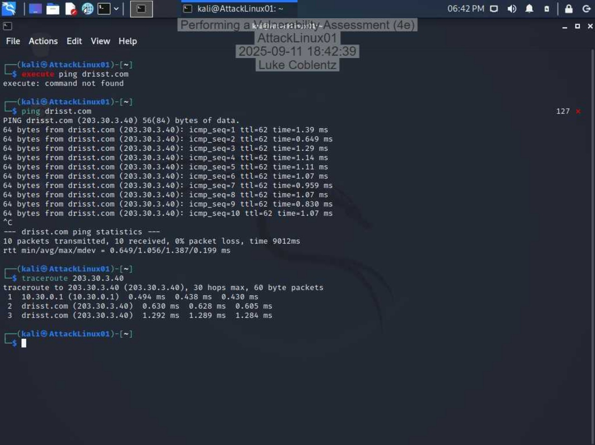

# Vulnerability Assessment & Penetration Testing

## Overview
This project demonstrates a full vulnerability assessment and basic penetration testing workflow using industry-standard tools. Network scanning, service enumeration, and vulnerability analysis were performed to identify security weaknesses and recommend mitigation strategies.

## Objective
- Perform network scanning and host discovery  
- Identify open ports and running services  
- Detect system vulnerabilities using automated tools  
- Evaluate risks and recommend remediation strategies  

---

## Tools Used
- Nmap / Zenmap  
- Nessus  
- Kali Linux  

---

## Assessment Summary

### 1. Network Scanning & Enumeration
- Conducted SYN scans using Zenmap to identify open ports  
- Discovered active hosts and exposed services  
- Enumerated services including FTP, SSH, and MySQL  

### 2. Operating System Detection
- Performed OS detection scans using Nmap  
- Identified target system type and configurations  
- Used fingerprinting techniques to analyze system behavior  

### 3. Service & Port Analysis
- Identified multiple open ports including:
  - Port 21 (FTP)
  - Port 22 (SSH)
  - Port 3306 (MySQL)  
- Detected running services and potential misconfigurations  

### 4. Vulnerability Scanning (Nessus)
- Conducted automated vulnerability scans  
- Identified multiple vulnerabilities with varying severity levels  
- Analyzed risk ratings and affected services  

---

## Key Findings

### High Severity Vulnerabilities
- Weak MySQL/MariaDB credentials (Severity: 9.0)  
- vsftpd backdoor vulnerabilities on ports 21 and 6200 (Severity: 7.5)  

### Medium Severity Vulnerabilities
- SNMP 'GETBULK' Reflection DDoS vulnerability (CVSS: 5.0)  
- SSL Medium Strength Cipher Suites (SWEET32) vulnerability (Severity: 7.5)  

---

## Risk Analysis
- Weak credentials allow unauthorized access through brute-force attacks  
- Backdoored services can provide attackers full system control  
- Misconfigured encryption exposes sensitive data  
- Vulnerabilities increase risk of data breaches and system compromise  

---

## Remediation Recommendations
- Enforce strong password policies and remove default credentials  
- Reinstall or replace compromised services (vsftpd) from trusted sources  
- Disable unnecessary services such as SNMP if not required  
- Configure systems to use strong encryption protocols and ciphers  
- Regularly update and patch systems to eliminate known vulnerabilities  

---

## Lessons Learned
- Vulnerability scanning is essential for identifying security weaknesses  
- Open ports and services provide critical attack vectors  
- Misconfigurations are a major source of security risk  
- Combining scanning tools improves detection accuracy  

---

## Skills Demonstrated
- Vulnerability assessment  
- Network reconnaissance and enumeration  
- Risk analysis and mitigation planning  
- Use of Nmap and Nessus  
- Security reporting and documentation  

---

## Screenshots

### Zenmap SYN Scan (Open Ports)

This scan identifies open ports and services running on the target system, revealing potential entry points for attackers.

---

### OS Detection Results

Operating system fingerprinting provides insight into system configuration and potential vulnerabilities.

---

### Service Scan Results

Service enumeration reveals running applications and versions, which can be analyzed for known vulnerabilities.

---

### Nessus Vulnerability Summary

The Nessus report highlights vulnerabilities along with severity ratings, helping prioritize remediation efforts.

---

### Nmap OS Detection (Terminal Output)

Detailed Nmap output shows open ports, detected services, and OS fingerprinting results.

---

### Traceroute Analysis

Traceroute results show the network path to the target, helping understand network structure and latency.

---

## Conclusion
This project demonstrates a complete vulnerability assessment process, from network scanning to risk evaluation and mitigation. By identifying weak credentials, backdoored services, and encryption issues, this assessment highlights the importance of proactive security testing. These techniques are essential for preventing real-world cyber attacks and strengthening system defenses.
